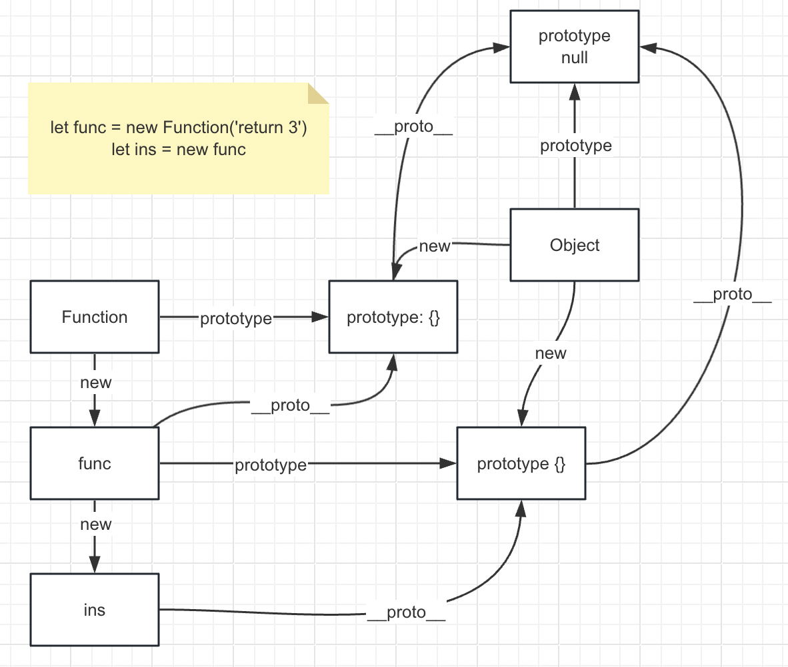

# 原型链

```js
let func = new Function('return 3')
let ins = new func

console.log(ins.__proto__ === func.prototype)

console.log(func.__proto__ === Function.prototype)
console.log(func.prototype.__proto__ === Object.prototype)

console.log(Function.prototype.__proto__ === Object.prototype)
```




JavaScript对象是动态的，即可以动态添加和删除属性。

对象是一个属性的无序集合，每 个属性都有名字和值。

字符串到值的映射

JavaScript使用术语`“自有属性”`指代非继承属 性。


----


除了名字和值之外，每个属性还有3个属性特性(property attribute)

- writable(可写)特性指定是否可以设置属性的值。
- enumerable(可枚举)特性指定是否可以在for/in循环中返 回属性的名字。
- configurable(可配置)特性指定是否可以删除属性，以及 是否可修改其特性。

很多JavaScript内置对象拥有只读、不可枚举或不可配置的属 性。

默认情况下，我们所创建对象的所有属性都是可写、可 枚举和可配置的


# 对象字面量

```js
let obj = {} // new Object
obj = new Array // []
obj = new Date
obj = new Set
```

new关键字后面必须 跟一个函数调用。以这种方式使用的函数被称为构造函数

[对象](https://www.bilibili.com/video/BV1tC4y1G7C2/?spm_id_from=333.1007.top_right_bar_window_history.content.click&vd_source=8f7ca74caf15b0f56c2cac7310b94eeb)

# Object.create()

传入null可以创建一个没有原型的新对象。 // 连toString()这种基本方法都没有

创建一个普通的空对象

```js
let obj = Object.create(Object.prototype) // {}、new Object
// obj.__proto__ === Object.prototype
```


`Object.create(proto, [propertiesObject])`：这是使用指定的原型对象创建一个新对象的方法。

第一个参数 `proto` 是新对象的原型；

第二个参数 `propertiesObject` 是可选的，用于定义新对象的属性。

相比之下，`{}` 和 `new Object()` 创建的对象的原型是  `Object.prototype`。

```js
// 创建一个函数对象
let myFunction = function() {
    console.log("This is a function created using Object.create");
};

console.log(myFunction.__proto__ === Function.prototype)

// 将函数对象的原型设置为 Function.prototype
myFunction.prototype = Object.create(Function.prototype);

console.log(myFunction.__proto__ === Function.prototype)
console.log(myFunction.prototype.__proto__ === Function.prototype)
```

**作用**

Object.create()的一个用途是防止对象被某个第三方库函数意 外(但非恶意)修改。

如果函数读取这个对象的属性，可以读到继承的值。而如果它设置这个对象的属性，则修改不会影响原始对象。

```js
let o = {x: 'don\'t change this value;'}

function f(arg) {
    arg.x = 'test'
}

f(Object.create(o)) // arg.__proto__ === o 。arg 是一个全新的对象，它只是继承了 o 对象的属性
console.log(o) // { x: "don't change this value;" }

f(o)
console.log(o) // { x: 'test' }
```


# 查询和设置属性

`.`  标识符标识、 `[]`

第二种语法使用方括号和字符串，看起来 像访问数组，只不过是以字符串而非数值作为索引的数组。

这种数 组也被称为关联数组(或散列、映射、字典)。JavaScript对象是 `关联数组`

`JavaScript对象是 关联数组`

在使用`.`操作符访问对象的属性时，属性名 是通过标识符来表示的。标识符必须直接书写在JavaScript程序 中，它们不是一种数据类型，因此不能被程序操作。

在通过方括号`[]`这种数组表示法访问对象属性时，属性名 是通过字符串来表示的。字符串是一种JavaScript数组类型，因此 可以在程序运行期间修改和创建。

```js
let obj ={a1:12,a2:34}
for(let i=0;i<12;i++){
    console.log(obj[`a${i+1}`])
}
```


尝试在对象o上设置属性p 在以下情况下会失败。

- o有一个只读自有属性p:不可能设置只读属性。
- o有一个只读继承属性p:不可能用同名自有属性隐藏只读继 承属性。
- o没有自有属性p，o没有继承通过设置方法定义的属性p，o的 extensible特性是false。因为p在o上并不存在，如 果没有要调用的设置方法，那么p必须要添加到o上。但如果o不可扩 展(extensible为false)，则不能在它上面定义新属性。


# 继承


假设要从对象o中`查询`属性x。这个过程一直持续，直至找到属性x或者查询到一个原型为null 的对象。

- 如果o没有叫这个名字的自有属性，则会从o的原型对象查询属性x。

- 如果原型对象也没有叫这个名字的自有属性，但它有自己的原型，则会继续查询这个原型的原 型。

```js
let a={}
Object.prototype.c=12

Object.getOwnPropertyDescriptor(Object.prototype,'c')
// {value: 12, writable: true, enumerable: true, configurable: true}
Object.getOwnPropertyDescriptor(a.__proto__,'c')
// {value: 12, writable: true, enumerable: true, configurable: true}
a.c =13
Object.prototype.c // 12
```


现在假设你为对象o的x属性`赋值`。

- 如果o有一个名为x的自有 (非继承)属性，这次赋值就会修改已有x属性的值。

- 否则，这次赋 值会在对象o上创建一个名为x的新属性。

- 如果o之前继承了属性x， 那么现在这个继承的属性会被新创建的同名属性隐藏。

```js
let o = {}
o.x = 12 // => 12
Object.prototype.c // => 12
```

```js
Object.prototype.c = 12 // 12
let a = {}
a.c = 14 // 14
Object.prototype.c // 12
a.c // 14
```


属性`赋值`要么失败要么在原始对象上创建或设置属性的规则有 一个 **例外**

当一个对象通过原型链继承了一个访问器属性（即具有 getter 和 setter 方法的属性），并且在子对象中尝试设置该属性时，实际上会调用该属性的 setter 方法，而不会在子对象上创建新的属性。

原型的  getter 和 setter  、 o对象的getter 和 setter 

```js
// 定义一个原型对象
const protoObj = {
  // 定义一个访问器属性 x
  get x() {
    console.log('Getter called');
    return this._x;
  },
  set x(value) {
    console.log('Setter called');
    this._x = value;
  }
};

// 创建一个对象，继承了原型对象的属性 x
const obj = Object.create(protoObj);
obj.x = 10;

console.log(obj.x);
console.log(protoObj.x)

/*
Setter called
Getter called
10
undefinded
*/
```


# 属性访问错误


# 删除属性

delete操作符用于从对象中移除属性

delete操作符只删除自有属性，不删除继承属性

delete不会删除configurable特性为false的属性: 严格：TypeError, 非严格 false

```js
let a = {c:12}
Object.getOwnPropertyDescriptor(a,'c')
// {value: 12, writable: true, enumerable: true, configurable: true}
```

非严格模式下删除全局对象可配置的属性: delete x

严格模式下，如果操作数是一个像x这样的非限定标识符， delete会抛出SyntaxError : delete global.x


# 测试属性

使用in操作符，或者hasOwnProperty()、 propertyIsEnumerable()方法，或者直接查询相应属性。

!= 不可以区分不存在的属性和存在但被设置为undefined的属性

```js
// 定义一个对象
var person = {
    name: 'John',
    age: undefined,
};

// 使用 in 操作符检查属性是否存在
console.log('name' in person); // 输出 true，属性存在
console.log('age' in person); // 输出 true，属性存在

// 使用 hasOwnProperty() 方法检查属性是否存在
console.log(person.hasOwnProperty('name')); // 输出 true，属性存在
console.log(person.hasOwnProperty('age')); // 输出 true，属性存在

// 直接查询属性
console.log(person.name !== undefined); // 输出 true，属性存在
console.log(person.age !== undefined); // 输出 false，属性不存在
```


propertyIsEnumerable(): 如果传入的命名属性是自有属性且这个属性的enumerable特性为 true，这个方法会返回true。

```js
// 定义一个对象
var obj = {
  prop1: 'value1',
  prop2: 'value2'
};

// 添加一个可枚举的属性
Object.defineProperty(obj, 'prop3', {
  value: 'value3',
  enumerable: true // 设置为可枚举
});

// 使用 propertyIsEnumerable() 方法检查属性是否可枚举
console.log(obj.propertyIsEnumerable('prop1')); // 输出 true，prop1 是可枚举的
console.log(obj.propertyIsEnumerable('prop2')); // 输出 true，prop2 是可枚举的
console.log(obj.propertyIsEnumerable('prop3')); // 输出 true，prop3 是可枚举的

// 添加一个不可枚举的属性
Object.defineProperty(obj, 'prop4', {
  value: 'value4',
  enumerable: false // 设置为不可枚举
});

// 使用 propertyIsEnumerable() 方法检查属性是否可枚举
console.log(obj.propertyIsEnumerable('prop4')); // 输出 false，prop4 是不可枚举的
```


# 枚举属性 for/in Object.....

防止通过for/in枚举继承的属性

```js
for(let p in o) {
		if (!o.has0wnProperty(p)) continue; // 跳过继承属性
}
for(let p in o) {
		if (typeof o[p] === "function") continue；// 跳过所有方法
}

```

有时候可以先获取对象所有属性名的数组，然后再通过for/of循环遍历该数组

**`Object.keys(obj)`**: 返回一个数组，包含对象 `obj` 自身的 `所有可枚举 `属性的名称。

```js
const obj = {
  a: 1,
  b: 2,
  [Symbol('c')]: 3
};

console.log(Object.keys(obj)); // ['a', 'b']
```

**`Object.getOwnPropertyNames(obj)`**: 返回一个数组，包含对象 `obj` 自身的所有属性的名称（包括不可枚举属性）。

```js
console.log(Object.getOwnPropertyNames(obj)); // ['a', 'b']
```

**`Object.getOwnPropertySymbols(obj)`**: 返回一个数组，包含对象 `obj` 自身的所有 Symbol 类型的属性。`无论是否可枚举`

```js
console.log(Object.getOwnPropertySymbols(obj)); // [Symbol(c)]
```

**`Reflect.ownKeys(obj)`**: 返回一个数组，包含对象 `obj` 自身的所有属性的名称（包括字符串键和 Symbol 键）。`无论是否可枚举`

```js
console.log(Reflect.ownKeys(obj)); // ['a', 'b', Symbol(c)]
```


## 属性枚举顺序

- ```
  先列出名字为非负整数的字符串属性，按照数值顺序从最小到最大。这条规则意味着数组和类数组对象的属性会按照顺序被枚举。
  ```

- ```
  在列出类数组索引的所有属性之后，再列出所有剩下的字符串名字(包括看起来像负数或浮点数的名字)的属性。这些属性按照它们添加到对象的先后顺序列出。对于在对象字面量中定义的属性，按照它们在字面量中出现的顺序列出。
  ```

- ```
  最后，名字为符号对象的属性按照它们添加到对象的先后顺序列出。
  ```


# 扩展对象 Object.assign()

Object.assign():  对于每个来源对象，它会把该对象的  `可枚举自有属性(包括名字为符号的属性)` 复制到目标对象

第一个来源对象的属性会覆盖 目标对象的同名属性，而第二个来源对象(如果有)的属性会覆盖 第一个来源对象的同名属性。

`Object.assign()` 只复制属性的值，而不是属性的特性（如 getter 和 setter）

```js
const source = {
    get x() {
        console.log('Getter called');
        return 'sourceX';
    }
};

const target = {};
Object.assign(target, source);

console.log(source) // { x: [Getter] }
console.log(target) // { x: 'sourceX' }
```


`扩展操作符 (...)` 返回一个新的对象或数组，在合并期间指定目标对象，则可以使用 `Object.assign()`。

```js
const obj1 = { a: 1, b: 2 };
const obj2 = { b: 3, c: 4 };
const mergedObj = { ...obj1, ...obj2 }; // { a: 1, b: 3, c: 4 }
```


# 序列化对象

对象序列化(serialization)是把对象的状态转换为字符串的 过程，之后可以从中恢复对象的状态。

`JSON.stringify()` 和 `JSON.parse()` 用于 `序列化` 和 `恢复JavaScript对象`。


# 对象方法

## toString()

当需要把一个对象转换为字符串时，JavaScript就会调用 该对象的这个方法


## toLocaleString()

返回对象的本地化字符 串表示。

Object定义的默认toLocaleString()方法本身没有实现任 何本地化，而是简单地调用toString()并返回该值。

Date和Number 类定义了自己的toLocaleString()方法，尝试根据本地惯例格式化 数值、日期和时间。

数组也定义了一个与toString()类似的 toLocaleString()方法，只不过它会调用每个数组元素的 toLocaleString()方法，而不是调用它们的toString()方法。


## valueOf()

在JavaScript需 要把对象转换为某些非字符串原始值(通常是数值)时被调用

Date类定义的 valueOf()方法可以将日期转换为数值，这样就让日期对象可以通过 <和>操作符来进行比较。


## toJSON()

Object.prototype实际上并未定义toJSON()方法，但 JSON.stringify()方法会从要序列化的对象上寻找 toJSON()方法

如果要序列化的对象上存在这个方法，就会调用 它，然后序列化该方法的返回值，而不是原始对象。

```js
// 定义一个对象
const obj = {
  name: 'John',
  age: 30,
  // 定义一个 toJSON() 方法
  toJSON: function() {
    // 返回一个新的对象，只包含 name 属性
    return { name: this.name };
  }
};

// 调用 JSON.stringify() 方法将对象序列化为 JSON 字符串
const jsonString = JSON.stringify(obj);

console.log(jsonString); // 输出: {"name":"John"}
```

Date类定义了自己的toJSON()方法，返回一个表示日期的序列化 字符串。


# 计算的属性名

有时候，我们需要创建一个具有特定属性的对象，但该属性的名字不是编译时可以直接写在源代码中的常量。在一个变量里，或者是调用的某个函数的返回值。

```js
// 定义一个变量，存储属性名
const propertyName = 'age';

// 创建一个空对象
const obj = {
  [propertyName]:133
};

console.log(obj); // 输出: { age: 133 }
```


# 符号作为属性名

在ES6及之后，属性名可以是字符串或符号

Symbol()不是 构造函数，不能使用new调用


# 扩展操作符 {...}

把已有对象的属性复制到新对象中 {...}

...语法经常被称为扩展操作符，但却不是真正意义上的 JavaScript操作符。实际上，它是仅在对象字面量中有效的一种特 殊语法(在其他JavaScript上下文中，三个点有其他用途。只有在对象字面量中，三个点才会产生这种把一个对象的属性复制到另一个对象中的插值行为)

```
扩展操作符只扩展对象的自有属性，不扩展任何
继承属性
```

随着n越来越 大，这个算法可能会成为性能瓶颈


# 简写方法

```js
let obj = {
  are:function(){}
  // are(){}
}
```


# 属性的获取方法与设置方法

数据属性之外，JavaScript还支持为 `对象定义访问器属性` : 一个获取方法(getter)和一个 设置方法(setter)。

```js
let obj = {
  get x(){}
  set x(value){}
}
```

